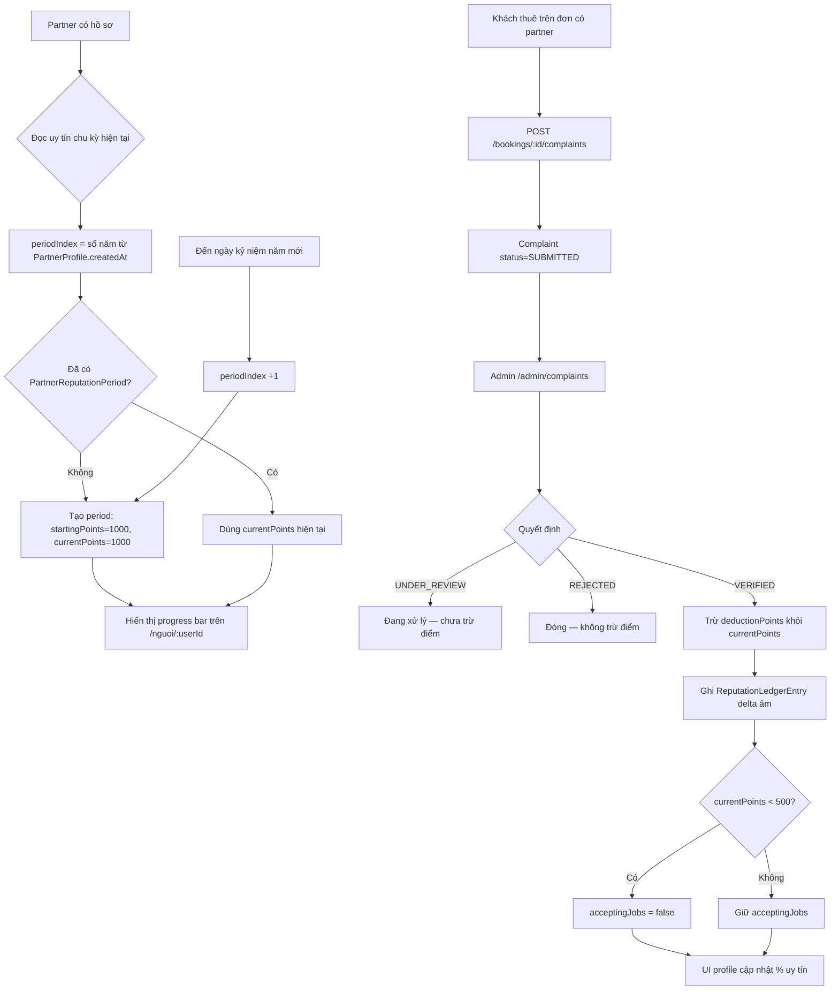

# Dịch Vụ Ơi

## Tổng quan

**Dịch Vụ Ơi** là sàn kết nối hai phía — giống mô hình **freelancer marketplace** — cho dịch vụ đa ngành nghề tại Việt Nam:

| Phía | Tên trong sản phẩm | Việc họ làm |
|------|--------------------|-------------|
| **Người làm** | Partner / Freelancer / Thợ | Mở hồ sơ người làm, nhận / thực hiện đơn, chào giá theo dịch vụ |
| **Khách thuê** | Customer / Khách | Duyệt danh mục, chọn dịch vụ / người làm, đặt lịch (thuê), thanh toán / đánh giá |

Elevator pitch: *Một tài khoản — vừa là khách thuê vừa là người làm khi muốn. Gọi là có người tới (hoặc online).*

### Một tài khoản, hai vai (kiểu Facebook)

Giống Facebook / Facebook Marketplace: **cùng một người** vừa là Khách thuê vừa có thể là Người làm — không tách hai loại tài khoản cứng.

```text
Đăng ký / Đăng nhập  →  1 User thật
        │
        ├─► Mode «Khách thuê» (dropdown header)
        │     /don-cua-toi · đặt lịch trên trang dịch vụ
        │
        └─► mode «Người làm» (dropdown header)
              lần đầu → form bật hồ sơ · sau đó /doi-tac nhận việc
```

- Đăng ký **một** tài khoản (email thật), không tách Customer vs Partner.
- Header có **dropdown chuyển vai**: Khách thuê ↔ Người làm (cùng session).
- Lần đầu chọn «Người làm» nếu chưa có hồ sơ → kích hoạt `PartnerProfile` trên account hiện tại.
- Schema `Role`: `CUSTOMER` mặc định; `PARTNER` khi đã bật nhận việc; `ADMIN` nội bộ. Thuê vẫn dùng được khi đang ở mode người làm.

Web dùng được trên desktop và **mobile responsive** (điện thoại, tablet).

Hai trục dịch vụ trong cùng sàn:

| Trục | Ví dụ | Đặc thù |
|------|--------|---------|
| Offline / tại chỗ | Dọn nhà, điện nước, chăm sóc | Địa chỉ, giờ hẹn, người làm đến nhà |
| Online / số | Gia sư, design, coaching game, code | Meeting/file — đúng kiểu thuê freelancer |

**Rủi ro chiến lược:** nếu mở hết ngành cùng lúc dễ thành “app gì cũng có nhưng không ngành nào sâu”. Launch nên hẹp theo MVP bên dưới.

## Mô hình khách thuê / người làm (freelancer-style)

```text
Cùng 1 User
  ├── Thuê: Tìm → chọn người / dịch vụ → đặt lịch → hoàn thành → đánh giá
  └── Nhận việc (khi đã mở hồ sơ): Nhận đơn mở hoặc nhận thuê trực tiếp → làm → hoàn thành
              ↕
         Sàn Dịch Vụ Ơi
         (catalog Group → Category → Service + PartnerService offerings)
```

- **Nhận việc / người làm** = cung ứng năng lực (thời gian, kỹ năng), không phải cho thuê tài sản cố định.
- **Thuê** = tạo booking; Người làm nhận / thực hiện — gần Upwork/Fiverr + thợ tại nhà.
- Catalog 3 tầng (`Group → Category → Service`) là **khung ngành**; mỗi Người làm gắn hồ sơ / giá riêng qua `PartnerService`.

### Kiếm tiền (bền vững)

| Nguồn | Khi nào | Ghi chú |
|--------|---------|---------|
| **Đặt cọc giữ chỗ (escrow)** | **Bắt buộc** ngay sau khi khách thuê / tạo đơn | Toàn bộ `totalPrice` giữ trên sàn (`UNPAID` → `HELD`). Chưa cọc → không vào hàng chờ, không chat, không lộ địa chỉ/SĐT cho partner. |
| **Hoa hồng theo đơn** | Khi `COMPLETED` → `RELEASED` | Mặc định **15%** (`commissionBps=1500`); phần còn lại `partnerPayout`. |

- Không bán SĐT / “phí xem thông tin” tách rời — lộ liên hệ gắn **đơn đã cọc**.
- Cổng thanh toán thật (MoMo/VNPay…) là bước tiếp; local dùng `POST /api/bookings/:id/pay` (mock).
- Hủy khi đang `HELD` → `REFUNDED` (chính sách phí hủy chi tiết có thể siết sau).

## Mô hình pháp lý & trách nhiệm (marketplace)

**Lựa chọn vận hành:** Dich Vụ Ơi là **sàn kết nối** (marketplace), **không** tuyển dụng / trả lương / điều hành người làm như nhân viên.

| Bên | Vai trò | Trách nhiệm chính |
|-----|---------|-------------------|
| **Khách thuê (A)** | Khách | Đặt lịch, đặt cọc, nhận dịch vụ, đánh giá / khiếu nại theo quy trình |
| **Người làm (B)** | **Đối tác độc lập** | Thực hiện dịch vụ; chịu trách nhiệm dân sự / hình sự nếu gây thiệt hại (ví dụ chiếm đoạt tài sản) |
| **Sàn Dich Vụ Ơi** | Trung gian | Catalog, kết nối, escrow, chat in-app, rating, hỗ trợ khiếu nại, hợp tác cơ quan có thẩm quyền khi được yêu cầu hợp pháp |

### Ranh giới rõ (tránh “Case 2 / Case 3”)

- **Không** quảng cáo kiểu *«100% thợ uy tín»*, *«đảm bảo tuyệt đối»*, *«đã xác minh lý lịch đầy đủ»* nếu chưa vận hành quy trình xác minh tương ứng.
- Badge **Đã xác thực** / `isVerified` = xác minh vận hành của sàn (hồ sơ / giấy tờ khi triển khai), **không** đồng nghĩa bảo lãnh mọi hành vi của đối tác.
- Người làm **không** là nhân viên công ty vận hành sàn — trừ khi sau này có hợp đồng lao động riêng (đổi mô hình).

### Nếu đối tác gây thiệt hại cho khách

Trong mô hình marketplace độc lập (tương tự Grab / Upwork / Fiverr khi ToS rõ):

1. Người gây hại chịu trách nhiệm hình sự / dân sự trực tiếp.
2. Sàn thường **không** bị truy cứu hình sự chỉ vì kết nối — nếu không biết trước ý định phạm tội và không bao che.
3. Sàn vẫn có thể phải: **hợp tác điều tra**, cung cấp lịch sử tài khoản / giao dịch / chat đơn (trong phạm vi pháp luật), xử lý khiếu nại theo chính sách.

**Case nguy hiểm cần tránh:** biết có tố cáo lừa đảo / chiếm đoạt mà vẫn cho nhận đơn, hoặc bao che / chia tiền — có thể bị xem xét trách nhiệm tùy hành vi.

### Biện pháp giảm rủi ro (đã có / roadmap)

Không miễn mọi trách nhiệm; giúp chứng minh sàn đã **quản lý rủi ro hợp lý**.

| Biện pháp | Trạng thái |
|-----------|------------|
| Điều khoản / chính sách phân định trách nhiệm các bên | **Có** — trang `/dieu-khoan`, `/chinh-sach-doi-tac`, khiếu nại / hoàn tiền |
| Escrow giữ tiền trên sàn + lịch sử đơn / thanh toán | **Có** (mock pay local; cổng thật sau) |
| Chat in-app + lọc PII; che SĐT public | **Có** |
| Đánh giá sau `COMPLETED`; badge verified admin | **Có** (verified = duyệt vận hành) |
| Admin khóa / xử lý đơn, flagged PII, hàng đợi duyệt partner | **Có một phần** |
| Xác minh CCCD / giấy tờ đối tác | **Roadmap** |
| Khóa / tạm ngưng nhận việc khi khiếu nại nghiêm trọng (workflow) | **Có một phần** — tự `acceptingJobs=false` khi uy tín &lt; 500 |
| Module khiếu nại formal + trừ điểm uy tín năm | **Có** — `Complaint`, `PartnerReputationPeriod`, Admin `/admin/complaints` |
| Module dispute formal + quỹ bồi thường / bảo hiểm trách nhiệm | **Roadmap** — tăng niềm tin, không bắt buộc lúc MVP |

### Nghĩa vụ vận hành sàn TMĐT dịch vụ (VN) — checklist thiết kế

Khi đưa lên production tại Việt Nam, nên thiết kế sớm (không phải cam kết đã làm đủ trong repo):

1. **Đăng ký / thông báo** hoạt động sàn giao dịch thương mại điện tử với cơ quan quản lý theo quy định hiện hành.
2. **Điều khoản sử dụng + chính sách bảo mật** công khai, dễ tìm (đã có trang tĩnh; rà pháp lý trước launch).
3. **Quy trình khiếu nại / giải quyết tranh chấp** có thời hạn phản hồi (trang hướng dẫn + kênh hỗ trợ; module dispute sau).
4. **Lưu trữ thông tin** giao dịch, định danh tài khoản, log cần thiết trong thời hạn luật yêu cầu (DB + backup prod).
5. **Hợp tác cung cấp thông tin** khi có yêu cầu hợp pháp từ cơ quan có thẩm quyền.
6. Không đưa ra **cam kết bảo đảm an toàn tuyệt đối** nếu chưa có biện pháp xác minh / bảo hiểm tương ứng.

> Tài liệu này **không phải tư vấn pháp lý**. Trước khi vận hành thương mại, nên rà với luật sư / đơn vị tư vấn TMĐT.

## Personas

| Vai trò | Ai | Mục tiêu chính |
|---------|-----|----------------|
| **User / Khách thuê** | Cá nhân, hộ, SME cần thuê | **Chỉ đặt / thuê** — có thể thuê **nhiều nghề** (Service) trên nhiều nhóm; bản thân **không phải** ngành nghề trên sàn |
| **Người làm** (khi đã bật hồ sơ) | Thợ / freelancer trên cùng account | Là bên **cung ứng nghề** — gắn một hoặc nhiều `PartnerService`; hiện trong danh sách người làm |
| **Admin** | Nội bộ | Duyệt hồ sơ, catalog, tranh chấp, khiếu nại |

### User được / không được gì

| | |
|--|--|
| **Được** | Duyệt catalog → chọn **nghề cụ thể** (Service) → chọn người làm → đặt lịch. Một user thuê được **nhiều nghề** khác nhau (nhiều đơn / nhiều lần). |
| **Không được** | Không phải “ngành nghề” (Group) và không đặt cả **nhóm bao quát** như một SKU. Group chỉ để điều hướng. User thuần túy cũng **không hiện** trong lưới người làm nghề — trừ khi tự bật «Người làm» (tạo `PartnerProfile`). |

`Role` kỹ thuật: `CUSTOMER` (mặc định, phía thuê) → nâng `PARTNER` khi bật nhận việc; không tạo account thứ hai.

- Đã có: thuê + danh sách Người làm theo dịch vụ; nhận việc; dual-role (bật nhận việc trên cùng account — tùy chọn, không bắt buộc).
- Hồ sơ người làm giàu thông tin (skills, districts, workModes, acceptingJobs…) + trang `/nguoi/:userId`; ẩn SĐT/email public.
- **Chọn nhiều nghề** trên Hồ sơ người làm: UI tags kiểu UE5 (`ProfessionTagsInput`) → đồng bộ `PartnerService` qua `PUT /api/partners/me/offerings` (`serviceIds[]`, tối đa 40). Gắn lúc bật nhận việc hoặc khi sửa hồ sơ `/doi-tac`.

## Danh mục — cấu trúc 3 tầng

```text
Nhóm bao quát (Group)     ← điều hướng trang chủ / mega menu
  └── Danh mục (Category) ← cột trong panel hover
        └── Dịch vụ (Service) ← SKU đặt được, có giá
```

- **Group** chỉ để phân loại và điều hướng — **không** phải gói combo, **không** đặt được.
- **Service (nghề)** mới là SKU User đặt được — một user có thể đặt **nhiều nghề** theo thời gian; mỗi đơn gắn một nghề + một Người làm.
- **Combo / Package** (mua nhiều dịch vụ một đơn) là entity riêng sau này, không nhét vào Group.
- Trang chủ hiện **tất cả nhóm ngành nghề** (`GET /api/groups`); `isFeatured` vẫn dùng để gắn nhãn hot / ưu tiên admin nếu cần.
- Catalog công khai (trang chủ, `/nhom`, menu nhóm, chi tiết dịch vụ) **chỉ hiện nghề online** (`Service.supportsOnline=true`). Nghề offline vẫn nằm trong DB/admin để quản trị; không lộ ra marketplace.

### Menu điều hướng (mega menu)

- Desktop: hover **Nhóm dịch vụ** → panel cây `Nhóm → Danh mục → Dịch vụ`.
- Mobile: nút / drawer mở cùng cây; chạm mũi tên để xổ danh mục.
- **Không hiện giá** trong panel hover / menu cây — giá chỉ hiện ở thẻ dịch vụ, trang chi tiết và khi đặt lịch.
- Giá catalog trên web là **giá tham khảo = khoảng giá thị trường** (`priceMin`–`priceMax`, nhãn «Giá tham khảo»); giá chào từng partner và `totalPrice` trên đơn là số tiền giao dịch.
- API tree: `GET /api/groups?tree=true`.

## Nhóm dịch vụ bao quát (tầm nhìn catalog)

22 nhóm là **tầm nhìn dài hạn**, không phải phạm vi launch ngày 1. Các nhóm online thuần (marketing, dịch thuật, trợ lý từ xa, tư vấn cá nhân, giải trí…) là phần khách nhìn thấy trên sàn khi chỉ hiện nghề `supportsOnline`. Cột **Ví dụ nghề / dịch vụ** liệt kê các nghề cụ thể (Service) nằm dưới mỗi nhóm — seed local đang seed dần theo danh sách này.

| Nhóm bao quát | Ví dụ nghề / dịch vụ bên trong | Ghi chú |
|---------------|--------------------------------|---------|
| **Nhà cửa - không gian sống** | Dọn nhà theo ca, giúp việc theo giờ, tổng vệ sinh, vệ sinh sau xây dựng, giặt sofa, vệ sinh rèm/thảm/đệm, khử khuẩn nhà, diệt côn trùng, vệ sinh kính cao tầng, dọn kho / gác | Core MVP offline |
| **Sửa chữa - kỹ thuật** | Sửa điện nước, sửa ổ cắm/đèn, thông tắc cống, vệ sinh máy lạnh, sửa tủ lạnh/máy giặt, lắp camera, sửa/tối ưu Wi‑Fi, chống thấm, sơn nhà, sửa khóa cửa, lắp quạt trần, bảo trì bình nóng lạnh | Core MVP offline |
| **Xây dựng - hoàn thiện** | Thợ hồ sửa nhỏ, ốp lát gạch, trần thạch cao, lắp đặt nội thất, làm cửa kính, lắp rèm, sơn bả tường, lát sàn gỗ, làm tủ bếp cơ bản, tháo dỡ nhẹ | Sau MVP |
| **Chăm sóc - sức khỏe** | Chăm sóc người già, bảo mẫu theo giờ, chăm bệnh nhẹ tại nhà, massage tại nhà, spa foot tại nhà, vật lý trị liệu hỗ trợ, đồng hành khám bệnh, chăm mẹ sau sinh | Core MVP offline |
| **Làm đẹp** | Makeup tại nhà, makeup cô dâu, nail tại nhà, gội đầu dưỡng sinh, cắt/uốn/nhuộm tóc tại nhà, nối mi, phun xăm hỗ trợ, chăm da mặt tại nhà | Sau MVP |
| **Bếp - đời sống** | Nấu ăn theo bữa, meal prep tuần, đi chợ hộ, giặt ủi, may sửa đồ, ủi đồ công sở, nấu tiệc nhỏ tại nhà, pha chế/đồ uống sự kiện | Sau MVP |
| **Xe - vận chuyển** | Rửa xe tại nhà, đánh bóng xe, cứu hộ xe nhẹ, tài xế theo giờ, chuyển nhà nhẹ, bê đồ văn phòng, giao hàng đặc biệt, thuê xe kèm tài | Một phần sau |
| **Học tập - ngoại ngữ** | Gia sư Toán/Lý/Hóa/Văn, IELTS, tiếng Anh giao tiếp, tiếng Trung/Nhật/Hàn, dạy nhạc (piano/guitar), dạy vẽ, tin học văn phòng, luyện thi đại học, dạy lập trình cho trẻ | Core MVP (gia sư) |
| **Game - eSports** | Coaching Liên Quân/LMHT/Valorant, review replay, setup PC gaming, tối ưu FPS, dạy làm game cơ bản, edit stream/highlight, quản lý kênh game (không cày thuê / boosting) | MVP số — hạn chế cày thuê (ToS) |
| **Lập trình - công nghệ** | Sửa máy/cài Windows, lập trình web/app nhỏ, fix bug, SEO kỹ thuật, Excel/macro, chatbot/API, WordPress, cài mạng văn phòng, hỗ trợ Google Workspace | MVP số |
| **Thiết kế - sáng tạo nội dung** | Logo/banner, UI/UX, edit TikTok/Reels/Short, viết content, voice-over, thiết kế menu/catalogue, retouch ảnh, thiết kế slide thuyết trình | MVP số |
| **Sự kiện - truyền thông** | Chụp/quay sự kiện, MC, livestream bán hàng, trang trí tiệc, ban nhạc acoustic, quay phóng sự ngắn, setup âm thanh ánh sáng nhỏ | Sau MVP |
| **Thú cưng** | Tắm cắt thú cưng, dắt chó, trông pet tại nhà, đưa khám thú y, huấn luyện cơ bản, vệ sinh chuồng/cát | Sau MVP |
| **Thể thao - PT** | PT gym 1 kèm 1, yoga tại nhà, dạy bơi, pickleball coach, tennis/cầu lông coach, chạy bộ coach, boxing/Muay cơ bản, dinh dưỡng tập luyện | Sau MVP |
| **Doanh nghiệp - văn phòng** | Dọn văn phòng, vệ sinh công nghiệp, lễ tân thời vụ, trợ lý hành chính theo giờ, sắp xếp kho/văn thư, phục vụ tea-break | B2B — sau |
| **Tài chính – hành chính – pháp lý hỗ trợ** | Kế toán hộ KD, kê khai thuế cơ bản, runner công chứng, nộp hồ sơ hành chính, tư vấn thủ tục cơ bản, soạn hợp đồng mẫu (đối tác có phép khi cần) | **Compliance** |
| **Sân vườn - ngoài trời** | Cắt cỏ, tỉa cây, chăm cây cảnh, tiểu cảnh ban công, vệ sinh hồ cá, lắp hệ thống tưới, dọn sân thượng | Sau MVP |
| **Marketing - bán hàng online** | Chạy ads Facebook/Google/TikTok, nghiên cứu từ khóa, tối ưu chuyển đổi, quản lý fanpage, vận hành Shopee / TikTok Shop, chăm sóc inbox, viết mô tả sản phẩm | Online 100% |
| **Dịch thuật - ngôn ngữ** | Dịch Anh/Trung/Nhật/Hàn – Việt, hiệu đính, phiên dịch online, làm phụ đề, gỡ băng ghi âm, chuẩn hóa CV tiếng Anh | Online 100% |
| **Trợ lý từ xa - vận hành** | Trợ lý ảo theo giờ, quản lý email – lịch hẹn, gọi xác nhận khách, nhập liệu, làm sạch dữ liệu, nghiên cứu thị trường, báo cáo định kỳ | Online 100% |
| **Tư vấn - phát triển cá nhân** | Hướng nghiệp, coach sự nghiệp, luyện phỏng vấn, tối ưu CV – LinkedIn, quản lý thời gian, dinh dưỡng, tham vấn tâm lý (có chứng chỉ), thiền chánh niệm | Online 100% — **compliance**: không thay tư vấn y tế |
| **Giải trí** | Hát live / karaoke đồng hành, ảo thuật online, DJ mix, MC tiệc online, RPG / board game, cờ vua–cờ tướng, quiz đêm, kể chuyện, xem phim đồng hành, trò chuyện theo chủ đề, gợi ý playlist | Online 100% — tách khỏi eSports; **không** nội dung người lớn / cày thuê |

## Hệ thống giao diện (UI)

Giao diện công khai theo hướng **sàn dịch vụ đáng tin cậy**: navy / teal / gold trên nền canvas sáng, card bo tròn, shadow nhẹ. Token nằm tại `apps/web/src/index.css` (`:root`).

### Màu hệ thống (chrome UI)

| Token CSS | Hex | Vai trò |
|-----------|-----|---------|
| `--color-navy` | `#073B5C` | Header full-bleed, tiêu đề section, chữ đậm trên nền sáng |
| `--color-navy-deep` | `#052D47` | Hover header / nút navy, nền badge cấp partner |
| `--color-brand` | `#009C95` | CTA chính (`.btn-primary`), link accent, viền tab active |
| `--color-brand-soft` | `#E8F7F5` | Nền chip marquee, tab active, `.icon-tile` (trust strip) |
| `--color-gold` | `#D9A441` | Badge cấp ★, viền nút «Đơn thuê» trên header navy |
| `--color-ink` | `#18313F` | Body text |
| `--color-muted` | `#6B7D87` | Phụ đề, label phụ |
| `--color-line` | `#E2E9EC` | Viền card, divider |
| `--color-canvas` | `#F7F9FA` | Nền trang |
| `--color-card` | `#FFFFFF` | Nền card |
| `--color-sale` | `#B42318` | **Giá**, số tiền đơn — không đổi theo ngành |

Shadow: `--shadow-card` = `0 6px 24px rgba(7,59,92,0.08)` · `--shadow-hover` khi hover card/nút.

### Typography & layout

- Font: **Be Vietnam Pro** (primary) + **Inter** fallback — khai báo trong `index.html` + `:root`.
- Base 16px, `-webkit-font-smoothing: antialiased`.
- Container công khai: **1280px** — `.page-container` / `.chrome-container` / `.section-container` (token `--container-page`).
- Dashboard khách thuê & người làm (`UserDashboardLayout`): sidebar + nội dung, kế thừa token (admin shell dùng cùng canvas/line).

### Component classes

| Class | Mô tả |
|-------|--------|
| `.surface-card` | Card trắng, viền `--color-line`, radius `--radius-xl` (16px), shadow card |
| `.btn-primary` | Teal → hover `--color-navy-deep` |
| `.btn-navy` | Nút navy solid |
| `.btn-outline-gold` | Viền gold trên nền header tối |
| `.icon-tile` | Ô icon trust strip: nền mint + icon teal (**không** dùng cho icon catalog ngành) |
| `.section-header-bar` | Khối tiêu đề section bo `--radius-lg` |
| `.field-input` | Input bo `--radius-md`, focus ring teal |

Radius token: `--radius-sm` 8px · `--radius-md` 12px · `--radius-lg` 14px · `--radius-xl` 16px.

### Header & trang chủ

- Header navy (`site-header.tsx`): logo trái · search giữa · tài khoản phải; dropdown khu vực / nhóm dịch vụ dùng prop `onDark`.
- Hero banner + benefit cards + chip marquee dịch vụ (`service-tag-nav`) — nền/viền theo token hệ thống.
- Tab «Dịch vụ nổi bật» trên home: active mint/teal (UI chung), **không** recolor theo ngành.

### Tách màu UI vs màu ngành (icon)

- **Chrome UI** (header, nút, card, tab, trust strip): luôn dùng token `:root` ở trên.
- **Icon & accent ngành** (mega menu, thẻ dịch vụ, sidebar catalog): giữ **màu riêng từng nhóm** qua `groupColor(slug).main` — **không** đổi icon catalog sang teal thương hiệu.
- Giá (`--color-sale`), CTA chính, trạng thái đơn: màu hệ thống, không theo ngành.
- Thanh uy tín partner: track hồng `#e91e8c`, fill gradient vàng→cam (ngoài palette navy/teal — nhận diện riêng).

## Bảng màu ngành nghề

Mỗi nhóm dịch vụ có **một màu nhận diện riêng** để phân biệt nhanh trên thẻ, menu và trang chi tiết.
Nguồn duy nhất: `apps/web/src/utils/catalog-colors.ts` — hàm `groupColor(slug)` trả về `{ main, soft, ink }`.

| Nhóm (slug) | `main` (nhấn) | `soft` (nền chip) | `ink` (chữ trên nền soft) |
|-------------|---------------|-------------------|---------------------------|
| Nhà cửa - không gian sống (`nha-cua`) | `#0f9d8a` | `#e6f6f3` | `#0a7a6b` |
| Sửa chữa - kỹ thuật (`sua-chua`) | `#2563eb` | `#e5edff` | `#1d4ed8` |
| Xây dựng - hoàn thiện (`xay-dung`) | `#b45309` | `#fdf0dc` | `#92400e` |
| Chăm sóc - sức khỏe (`cham-soc`) | `#e11d74` | `#fde7f1` | `#be1560` |
| Làm đẹp (`lam-dep`) | `#c026d3` | `#fbe8fe` | `#a21caf` |
| Bếp - đời sống (`bep-doi-song`) | `#ea580c` | `#ffeade` | `#c2410c` |
| Xe - vận chuyển (`xe`) | `#0e7490` | `#dff4f9` | `#155e75` |
| Học tập - ngoại ngữ (`hoc-tap`) | `#4f46e5` | `#e8e7fd` | `#4338ca` |
| Game - eSports (`game`) | `#7c3aed` | `#eee8fe` | `#6d28d9` |
| Lập trình - công nghệ (`lap-trinh`) | `#0284c7` | `#e0f2fe` | `#0369a1` |
| Thiết kế - sáng tạo nội dung (`thiet-ke`) | `#db2777` | `#fde8f1` | `#be185d` |
| Sự kiện - truyền thông (`su-kien`) | `#9333ea` | `#f2e9fe` | `#7e22ce` |
| Thú cưng (`thu-cung`) | `#d97706` | `#fef1d9` | `#b45309` |
| Thể thao - PT (`the-thao`) | `#16a34a` | `#e3f7e9` | `#15803d` |
| Doanh nghiệp - văn phòng (`doanh-nghiep`) | `#475569` | `#eaeef4` | `#334155` |
| Tài chính – hành chính – pháp lý (`tai-chinh`) | `#0f766e` | `#e0f2f0` | `#115e59` |
| Sân vườn - ngoài trời (`san-vuon`) | `#65a30d` | `#eef8dc` | `#4d7c0f` |
| Marketing - bán hàng online (`marketing-online`) | `#dc2626` | `#fee7e7` | `#b91c1c` |
| Dịch thuật - ngôn ngữ (`ngon-ngu`) | `#ca8a04` | `#fdf4d7` | `#a16207` |
| Trợ lý từ xa - vận hành (`tro-ly-tu-xa`) | `#78716c` | `#f1efed` | `#57534e` |
| Tư vấn - phát triển cá nhân (`tu-van-phat-trien`) | `#059669` | `#dff5ec` | `#047857` |
| Giải trí (`giai-tri`) | `#eab308` | `#fef9c3` | `#a16207` |

Slug lạ / thiếu màu → fallback `#0f9d8a` (chỉ cho **icon/viền ngành**, khác `--color-brand` `#009C95` của UI chrome).

### Quy tắc dùng màu

- `main`: viền nhấn (border-top thẻ dịch vụ, border-left thẻ nhóm), **icon nhóm** trong mega menu / marquee / catalog, gạch tiêu đề danh mục.
- `soft`: nền chip / badge (tên nhóm trên thẻ dịch vụ, link “← nhóm”, số danh mục), nền item nhóm đang chọn.
- `ink`: màu chữ khi đặt trên nền `soft` — luôn cặp `soft` + `ink`, không dùng `main` làm chữ trên nền `soft`.
- **Không** đổi màu giá (`--color-sale`), nút CTA chính (`.btn-primary`) hay trạng thái đơn theo ngành — các màu đó thuộc [hệ thống giao diện](#hệ-thống-giao-diện-ui).
- Màu ngành chỉ dùng ở tầng **Group**; Category và Service kế thừa màu của group cha, không tự định nghĩa màu riêng.

Nơi đang áp dụng **màu ngành** (icon / viền / chip nghề): `service-card.tsx`, `group-card.tsx`, `catalog-menu-shared.tsx`, `catalog-menu.tsx`, `service-tag-nav.tsx` (chỉ **icon**), `group-detail-page.tsx`, `group-detail-hero.tsx`, `service-detail-page.tsx` (accent nhóm), `groups-page.tsx`, `profession-tags-input.tsx`, `partner-profile-page.tsx` (chip nghề), `hire-service-form.tsx`.

## Tỉnh / thành (khu vực)

Dropdown khu vực trên ô tìm kiếm header (icon pin + tên + chevron) — chọn **một** trong **34 đơn vị hành chính cấp tỉnh** theo Nghị quyết 202/2025/QH15 (có hiệu lực từ 1/7/2025): **6 thành phố** + **28 tỉnh**.

- Nguồn duy nhất: `apps/web/src/data/provinces.ts` (`PROVINCES`, `filterProvinces`, `loadProvinceSlug` / `saveProvinceSlug`).
- UI: `apps/web/src/components/layout/location-picker.tsx` — mở dropdown → ô **tìm kiếm** (bỏ dấu: «ha noi» khớp «Hà Nội») → chọn → lưu `localStorage` key `dichvuoi.province`.
- Mặc định: **Hồ Chí Minh** (`ho-chi-minh`).
- Thành phố đánh dấu nhãn **TP** trong list; tỉnh không có nhãn phụ.

### 6 thành phố trực thuộc TW

| Tên | slug |
|-----|------|
| Hà Nội | `ha-noi` |
| Hải Phòng | `hai-phong` |
| Đà Nẵng | `da-nang` |
| Huế | `hue` |
| Cần Thơ | `can-tho` |
| Hồ Chí Minh | `ho-chi-minh` |

### 28 tỉnh

| Tên | slug | Tên | slug |
|-----|------|-----|------|
| An Giang | `an-giang` | Lào Cai | `lao-cai` |
| Bắc Ninh | `bac-ninh` | Nghệ An | `nghe-an` |
| Cà Mau | `ca-mau` | Ninh Bình | `ninh-binh` |
| Cao Bằng | `cao-bang` | Phú Thọ | `phu-tho` |
| Đắk Lắk | `dak-lak` | Quảng Ngãi | `quang-ngai` |
| Điện Biên | `dien-bien` | Quảng Ninh | `quang-ninh` |
| Đồng Nai | `dong-nai` | Quảng Trị | `quang-tri` |
| Đồng Tháp | `dong-thap` | Sơn La | `son-la` |
| Gia Lai | `gia-lai` | Tây Ninh | `tay-ninh` |
| Hà Tĩnh | `ha-tinh` | Thái Nguyên | `thai-nguyen` |
| Hưng Yên | `hung-yen` | Thanh Hóa | `thanh-hoa` |
| Khánh Hòa | `khanh-hoa` | Tuyên Quang | `tuyen-quang` |
| Lai Châu | `lai-chau` | Vĩnh Long | `vinh-long` |
| Lâm Đồng | `lam-dong` | | |
| Lạng Sơn | `lang-son` | | |

Lọc danh sách Người làm theo tỉnh (trang dịch vụ) và seed `PartnerProfile.city` nên dùng cùng tên `Province.name` trong bảng trên.

## Hồ sơ khách thuê / người làm (giàu thông tin)

Lấy cảm hứng độ sâu từ marketplace kiểu PlayerDuo, nhưng **mọi field phục vụ quyết định thuê hoặc nhận việc** — không copy donate / newsfeed / album đời tư.

### Ba tầng thông tin

| Tầng | Nội dung | Mục đích |
|------|----------|----------|
| **Ai làm** (`PartnerProfile`) | avatar, tên, headline, bio, cấp, verified, city, **districts**, **skills**, **workModes** (onsite/online), **acceptingJobs**, **responseMinutes** | Tin cậy + phạm vi phục vụ |
| **Làm gì** (`PartnerService`) | giá, headline, KN, **includes** / **excludes** / **coverageNote** theo từng dịch vụ catalog | Chọn gói thuê cụ thể |
| **Thuê thế nào** (`Booking`) | lịch, địa chỉ (hoặc link họp), note | Hoàn tất đơn |

### Quy tắc riêng Dich Vụ Ơi

- **SĐT / email không công khai** trên tile, hover, `GET /api/services/:slug/partners`, `GET /api/partners/public/:userId`.
- **Lộ liên hệ theo giai đoạn đơn** (chống bỏ sàn) — xem [Chống bỏ sàn](#chống-bỏ-sàn-disintermediation): việc mở che SĐT + địa chỉ; khách **không bao giờ** thấy SĐT/email partner; partner chỉ thấy SĐT khách từ `IN_PROGRESS`; kênh chính là **chat đơn** (`BookingMessage`).
- Trang hồ sơ công khai: `/nguoi/:userId` — CTA Thuê dẫn về `/dich-vu/:slug`.
- **Nhấp vào thẻ Người làm** (avatar / tên / giá trên lưới trang dịch vụ) → mở trang hồ sơ `/nguoi/:userId`. Hover chỉ xem nhanh; nút **Thuê** riêng để chọn người đặt lịch (không chuyển trang).
- Dashboard `/doi-tac` sửa đủ field P0 (kỹ năng, quận, hình thức, đang nhận việc, phút phản hồi).
- **Không** đưa donate, feed MXH, cày thuê/boosting trái ToS vào hồ sơ.

### Schema (P0 đã có)

`PartnerProfile`: `districts`, `skillsJson`, `acceptingJobs`, `workModes`, `responseMinutes`  
`PartnerService`: `includes`, `excludes`, `coverageNote`  
`Booking`: `paymentStatus`, `commissionBps`, `commissionAmount`, `partnerPayout`, `paidAt` / `releasedAt` / `refundedAt`  
`BookingMessage`: chat theo đơn (`body`, `redacted`)  
`Review`: đánh giá hai chiều (`rating`, `comment`, unique booking+fromUser)

### Retention — quan hệ & thuê lại (P0, đã có)

Lấy cảm hứng từ [Player Duo](https://playerduo.net/) về **giữ chân qua quan hệ cá nhân**, không copy feed/donate/truyện tranh.

| Tính năng | API / UI | Mục đích |
|-----------|----------|----------|
| **Lưu người làm quen** | `PartnerFavorite`; `GET/POST/DELETE /api/partners/favorites*`; nút trái tim trên `/nguoi/:userId` | Gắn bó partner, quay lại không cần tìm lại |
| **Thuê lại nhanh** | `GET /api/bookings/rebook-hints`; section trang chủ + nút trên đơn `COMPLETED` | Một chạm → `/dich-vu/:slug?partner=:userId` |
| **Cá nhân hóa «Đề xuất»** | `rankFeaturedServices()` — ưu tiên nhóm/dịch vụ đã thuê, bỏ shuffle ngẫu nhiên | Trang chủ relevant hơn cho khách cũ |
| **Profile = landing thuê** | Giá từ `/giờ`, CTA «Đặt lịch ngay», deep-link `?partner=` | Giống trang idol Player Duo nhưng vẫn escrow |

**Không làm (non-goals retention):** newsfeed MXH, donate, bảng xếp hạng đại gia, chat public ngoài đơn.

### Uy tín partner — điểm năm & khiếu nại (P0, đã có)

Tách biệt với **cấp độ merit (1–100)** — uy tín đo **tuân thủ / khiếu nại**, không phải kinh nghiệm.

| Khái niệm | Giá trị / quy tắc |
|-----------|-------------------|
| **Điểm khởi đầu** | **1000** mỗi chu kỳ |
| **Chu kỳ** | Một năm kể từ **ngày tạo hồ sơ partner** (`PartnerProfile.createdAt`), không theo lịch 1/1 |
| **Reset** | Sang chu kỳ mới → tạo `PartnerReputationPeriod` mới với 1000 điểm (lazy khi đọc/ghi) |
| **Trừ điểm** | Chỉ khi Admin đặt khiếu nại `VERIFIED` (mặc định −100; preset −50 / −100 / −200) |
| **Sàn tự động** | Uy tín &lt; **500** → `acceptingJobs = false` (partner tạm không nhận việc mới) |
| **UI công khai** | Thanh progress trên `/nguoi/:userId` — nền hồng, fill gradient vàng→cam = điểm còn lại |

**Schema:** `Complaint`, `PartnerReputationPeriod`, `ReputationLedgerEntry`  
**API:** `POST /api/bookings/:id/complaints` · `GET /api/complaints/mine` · `GET/PATCH /api/admin/complaints*` · `GET /api/partners/public/:userId` (kèm `reputation`)

#### Behavior tree — uy tín & khiếu nại



**Luồng tóm tắt:**

1. **Khách** — Đơn của tôi → Chi tiết đơn → «Gửi khiếu nại» (hoặc email/hotline trang `/khieu-nai`).
2. **Admin** — `/admin/complaints` → Nhận xử lý → **Xác minh đúng & trừ điểm** hoặc Từ chối.
3. **Partner** — Thanh uy tín trên profile công khai; điểm không âm (floor 0).
4. **Khác cấp độ** — `level` (1–100) vẫn tính từ giờ làm, đánh giá, verified; **không** trộn với uy tín.

### Roadmap P1 / P2

- P1: gallery portfolio 3–6 ảnh; % đúng hạn từ booking `COMPLETED`; **push/PWA nhắc lịch định kỳ**
- P2: lịch trống (availability filter trên trang dịch vụ); intro video ngắn (ngành online); escrow thanh toán thật; đặt lịch định kỳ (dọn 2 tuần/lần, gia sư 3 buổi/tuần)

## Tìm kiếm không dấu + gần đúng

Tiện ích chung: `apps/web/src/utils/search.ts`.

- `normalizeText(s)`: bỏ dấu tiếng Việt + hạ chữ thường (`Sửa chữa` → `sua chua`, `Đà Nẵng` → `da nang`).
- `levenshtein(a, b)`: khoảng cách sửa để đo độ gần đúng.
- `fuzzyMatch(haystack, query)`: khớp khi (1) trùng chuỗi con sau bỏ dấu, hoặc (2) **mỗi từ khoá** khớp một từ trong text qua substring / Levenshtein trong ngưỡng theo độ dài (≤2:0, ≤4:1, ≤7:2, còn lại 3), hoặc (3) gõ tắt liền chuỗi (subsequence).

Ví dụ: `sua` → «Sửa chữa», `dien lanh` → «Điện lạnh», `giasu` → «Gia sư», `ha noi` → «Hà Nội», typo `sưat` vẫn khớp.

Nơi áp dụng:
- Trang `/nhom` (`groups-page.tsx`): tìm trên **cả cây** nhóm → danh mục → dịch vụ; trả 2 khối kết quả «Nhóm dịch vụ» + «Dịch vụ khớp».
- Dropdown tỉnh/thành (`location-picker.tsx` qua `filterProvinces`).
- Bộ lọc Người làm ở trang dịch vụ (tên / khu vực) — `service-detail-page.tsx`.

## Định hướng sản phẩm & MVP

Nên bắt đầu với một số nhóm nhu cầu cao thay vì mở toàn bộ 17 ngành.

### MVP dịch vụ truyền thống

1. Dọn dẹp nhà  
2. Vệ sinh và sửa chữa điện lạnh  
3. Sửa điện nước  
4. Gia sư  
5. Chăm sóc tại nhà  

### MVP nhóm số / sáng tạo

1. Sửa máy / cài đặt  
2. Thiết kế banner – logo  
3. Edit video ngắn  
4. Gia sư tin học / Excel  
5. Coaching game (**ưu tiên coaching, không boosting**)  
6. Lập trình freelance nhỏ (landing, bot, fix bug)  

### Nguyên tắc theo ngành

Mỗi ngành cần có: quy trình đặt lịch, cách tính giá, tiêu chuẩn đối tác, chính sách khiếu nại riêng.

**Game - eSports:** ưu tiên coaching, setup PC, edit stream, dạy làm game; nếu có cày thuê thì cần disclaimer + whitelist game cho phép.

**Tài chính / pháp lý hỗ trợ:** không mở free-for-all; chỉ đối tác đủ điều kiện / có phép khi pháp luật yêu cầu.

### Non-goals (chưa làm ở giai đoạn này)

- Matching tự động thông minh  
- Cổng thanh toán cổng thật (MoMo/VNPay) — hiện **escrow mock**  
- Geo quận-huyện sâu; gói combo (Package)  
- Partner tự đăng gói dịch vụ riêng (đang dùng catalog chung)  

## Booking (thuê dịch vụ)

Luồng đơn khi **Khách thuê** đặt (Prisma `BookingStatus`):

```text
PENDING → CONFIRMED → IN_PROGRESS → COMPLETED
                 ↘ CANCELLED
```

Escrow / đặt cọc (`PaymentStatus`):

```text
UNPAID → HELD (POST /bookings/:id/pay — bắt buộc) → RELEASED (khi COMPLETED)
                                      ↘ REFUNDED (khi CANCELLED lúc đang HELD)
```

**Bắt buộc đặt cọc khi thuê**

1. Customer đăng nhập → tạo đơn (`PENDING` chờ nhận, hoặc thuê thẳng → `CONFIRMED`), lúc này `paymentStatus=UNPAID`.
2. Customer **đặt cọc giữ chỗ** (mock) → `HELD`. UI: nút trên `/dat-lich/:id` và `/don-cua-toi`.
3. Chỉ đơn `HELD` mới:
   - xuất hiện trong `GET /bookings/open` (hàng chờ partner);
   - được `accept` (nhận việc);
   - mở chat `GET|POST /bookings/:id/messages`;
   - lộ địa chỉ cho partner (sau `CONFIRMED`) theo `contact-privacy`.
4. Partner **chỉ `IN_PROGRESS` khi đã `HELD`**.
5. `COMPLETED` → giải ngân: `RELEASED`, trừ hoa hồng 15% (`commissionBps=1500`).
6. Review hai chiều sau `COMPLETED`: `POST /api/bookings/:id/reviews` (mỗi bên 1 lần).

Xem hồ sơ / lưới người làm trên trang dịch vụ vẫn **miễn phí** — cọc chỉ khi đã tạo đơn thuê.

## Admin

- Seed: `admin@dichvuoi.vn` / `demo1234` (role `ADMIN`).
- Web: `/admin` — shell sidebar riêng (không dùng header/footer marketplace). Layout: Tổng quan · Đơn hàng · Dịch vụ · Đối tác · Khách hàng · Đánh giá · Khiếu nại.

### Màn hình `/admin`

Layout chung (`pages/admin/admin-layout.tsx`) chặn non-ADMIN, hiện nav + badge số việc tồn
(hồ sơ chờ duyệt, tin bị lọc). Mỗi tab là một route riêng — bookmark / share link được.

| Route | Làm gì |
|-------|--------|
| `/admin` | Tổng quan KPI + shortcut hàng đợi |
| `/admin/bookings` | Danh sách đơn — filter status / escrow / ngày |
| `/admin/bookings/:id` | **Chi tiết đơn kiểu ops**: header + actions, 3 cột (Các bên / Escrow / Timeline), chat bubble, đánh giá |
| `/admin/catalog` | CRUD dịch vụ + featured nhóm |
| `/admin/partners` | Hàng đợi duyệt hồ sơ |
| `/admin/users` | Khách hàng — đổi role |
| `/admin/reviews` | Đánh giá |
| `/admin/complaints` | Hàng đợi khiếu nại đơn — xác minh & trừ uy tín |
| `/admin/flagged` | Tin chat bị lọc PII |

Bộ lọc sống trong URL (`?q=&status=&page=`), đổi filter tự reset về trang 1.

### API `@Roles(ADMIN)` dưới `/api/admin/*`

| Endpoint | Ghi chú |
|----------|---------|
| `GET stats` | users, partners, **partnersPendingVerify**, đơn, GMV hoàn thành, escrow, hoa hồng, reviews, tin bị lọc |
| `GET users` | `?q&role&page&pageSize` |
| `PATCH users/:id` | đổi role |
| `GET partners` | `?q&verified&acceptingJobs&city&page&pageSize` — chưa verify lên đầu |
| `PATCH partners/:userId` | `isVerified` / `acceptingJobs` |
| `GET bookings` | `?q&status&paymentStatus&from&to&page&pageSize` |
| `GET bookings/:id` | chi tiết + messages (kèm `redacted`) + reviews |
| `PATCH bookings/:id` | force status / escrow / hoàn tiền |
| `GET reviews` | `?q&page&pageSize` |
| `GET messages/flagged` | `?q&page&pageSize` |
| `GET catalog` | cây `Group → Category` + đếm |
| `GET categories` | danh mục phẳng (đổ vào select khi tạo dịch vụ) |
| `GET services` | `?q&groupId&categoryId&isActive&page&pageSize` |
| `POST services` | tạo dịch vụ (slug tự sinh từ tên nếu bỏ trống, trùng slug → 409) |
| `PATCH services/:id` | sửa / bật / tắt |
| `PATCH groups/:id` | bật / tắt `isFeatured` |

Mọi endpoint list trả `{ items, total, page, pageSize, pageCount }` (mặc định 20/trang, tối đa 100).

### Chưa có (roadmap admin)

- ~~Module tranh chấp / khiếu nại riêng~~ → **đã có** `/admin/complaints` + trừ uy tín năm
- Hành động trên tin bị lọc (cảnh cáo / khóa chat / ban) và ẩn review giả
- Audit log cho mọi thao tác admin; role nội bộ `SUPPORT` tách khỏi `ADMIN`
- Biểu đồ GMV / funnel theo thời gian, export CSV

## Chống bỏ sàn (disintermediation)

Mục tiêu thực tế (Upwork, Fiverr, Airbnb, TaskRabbit): **không chặn 100%**, mà làm việc ngoài sàn rủi ro hơn / kém lợi hơn, trì hoãn lộ danh tính liên hệ, và giữ giá trị (escrow, dispute, rating) trên Dich Vụ Ơi.

### Nguyên tắc sản phẩm

| Lớp | Cách làm | Tham khảo |
|-----|----------|-----------|
| **Che liên hệ** | Public không SĐT/email; việc mở che SĐT + địa chỉ; khách không thấy SĐT partner | Upwork, Fiverr |
| **Chat in-app** | `BookingMessage` — lọc SĐT, email, Zalo/FB/Telegram; **chỉ sau khi đã cọc + có partner** | Fiverr Inbox |
| **Lộ dần** | Địa chỉ đủ sau `CONFIRMED` **và** `HELD`; SĐT khách từ `IN_PROGRESS` | Handy / logistics |
| **Tiền qua sàn** | **Bắt buộc đặt cọc** (`HELD`) trước hàng chờ / nhận việc / chat; ToS cấm CK ngoài | Upwork Milestone |
| **Giá trị ở lại** | Rating, verified, dispute, bảo hiểm đơn (sau) | Airbnb |
| **ToS + phạt** | Cấm trao đổi liên hệ ngoài kênh; suspend khi tái phạm | Mọi sàn lớn |

### Quy tắc lộ dữ liệu API (đã code)

Utility: `apps/api/src/common/contact-privacy.ts` — mọi response booking đi qua `shapeBookingForViewer` (có xét `paymentStatus`).

| Viewer | Điều kiện | SĐT khách | Địa chỉ | SĐT/email partner |
|--------|-----------|-----------|---------|-------------------|
| Open queue | `PENDING` + **`HELD`** (API chỉ trả đơn đã cọc) | Che | Che | — |
| Partner | `CONFIRMED` nhưng `UNPAID` | Che | Che | — |
| Partner | `CONFIRMED` + `HELD` | Che | Đủ | (tự xem account mình) |
| Partner | `IN_PROGRESS` / `COMPLETED` + funded | Đủ | Đủ | — |
| Customer | mọi | SĐT mình (đủ) | Đủ | **Không bao giờ** |
| Admin | mọi | Đủ | Đủ | Đủ |

Response thêm: `contactPolicy` (`channel: in_app`, `phoneRevealed`, `addressRevealed`, `hint`), `customerPhoneMasked`, `addressMasked`.

### Chat đơn + lọc PII

- Model `BookingMessage` (`body`, `redacted`).
- `redactContactLeak` / `detectContactLeak`: SĐT, email, `zalo.me`, facebook, telegram, discord…
- Ghi chú đặt lịch (`note`) cũng bị lọc khi tạo đơn.
- Chat API từ chối nếu chưa `HELD` hoặc chưa có `partnerId`.
- UI: `BookingChat` trên `/don-cua-toi` và `/doi-tac` khi đơn đã cọc + `CONFIRMED` / `IN_PROGRESS`.

### Roadmap chống bỏ sàn

1. ~~Đặt cọc bắt buộc + escrow mock~~ — **đã có**; nối cổng thật  
2. Báo cáo tin nhắn + review thủ công pattern bypass  
3. Bảo hiểm đơn + quy trình tranh chấp  
4. Giảm hoa hồng theo level / đơn hoàn thành trên sàn (carrot)
5. (Tuỳ chọn) cọc một phần % thay vì full `totalPrice`

**Giới hạn:** dịch vụ tại nhà (gặp mặt) không chặn hết được — tối ưu lần thuê đầu và đơn lẻ qua sàn; ngành online dễ khóa hơn.

## Đối thủ & khoảng trống định vị

### Giúp việc / nhà cửa

- bTaskee, JupViec, beHome / be Giúp Việc — sâu một ngành, ops mạnh.

### Thợ / đa ngành kỹ thuật

- Vua Thợ, Ong Thợ, Thợ Việt, Thợ Top, Alo Dịch Vụ.

### Khoảng trống Dịch Vụ Ơi nhắm tới

1. **Sàn khách thuê / người làm đa ngành** (offline tại nhà + freelancer số), không chỉ app một nghề.  
2. Người làm đăng ký như freelancer; người cần việc thuê theo lịch / gói — gần Fiverr/Upwork + thợ tại nhà.  
3. Tránh “catalog rộng, ops nông” — bám MVP hẹp (ưu tiên luồng thuê của Customer) rồi mới mở onboarding người làm.  

## Tiến độ kỹ thuật

### Đã có (MVP local)

- Monorepo `apps/web` + `apps/api`
- Catalog 3 tầng + seed ~22 nhóm / nhiều nghề cụ thể (`prisma/catalog-data.ts`), mega menu (desktop hover / mobile drawer)
- Auth JWT + dual-role: dropdown header chuyển **Khách thuê** / **Người làm** (cùng account)
- Thuê dịch vụ → đơn `PENDING` hoặc thuê thẳng partner → `CONFIRMED`; `/don-cua-toi`
- Danh sách Người làm theo dịch vụ (`GET /api/services/:slug/partners`) — **không trả SĐT/email**
- **Chống bỏ sàn P0:** che liên hệ theo vai trò/trạng thái (`contact-privacy.ts`); chat đơn `BookingMessage` + lọc PII; UI chat trên đơn thuê / việc của partner
- **Escrow mock** (`PaymentStatus`): **bắt buộc đặt cọc** `pay` → `HELD` trước hàng chờ / nhận việc / chat / lộ địa chỉ; `RELEASED` + hoa hồng 15% khi hoàn thành; chặn `IN_PROGRESS` khi chưa `HELD`
- **Review hai chiều** sau `COMPLETED` (cập nhật `PartnerProfile.ratingAvg`)
- **Admin dashboard** `/admin` (nested routes) + `/api/admin/*`: tổng quan có GMV/escrow, list có **search + filter + phân trang**, hàng đợi duyệt hồ sơ partner, **chi tiết đơn** (chat đầy đủ + timeline escrow), **CRUD dịch vụ** & bật/tắt nhóm featured — xem mục [Admin](#admin)
- Hồ sơ công khai `/nguoi/:userId` (`GET /api/partners/public/:userId`): skills, districts, workModes, acceptingJobs, responseMinutes, offerings (includes/excludes/coverageNote); **lưu partner yêu thích**
- **Retention P0:** lưu người làm quen (`PartnerFavorite`); gợi ý thuê lại (`GET /api/bookings/rebook-hints`); trang chủ section «Thuê lại nhanh» / «Người làm quen»; đề xuất dịch vụ theo lịch sử thuê (không shuffle); deep-link `?partner=` trên `/dich-vu/:slug`
- Card dịch vụ: bỏ badge «Đã xác thực»; hiện **số người làm nghề** (`_count.partners`) thay cho «lượt đặt»
- Trang chi tiết dịch vụ `/dich-vu/:slug`:
  - Cột trái: ảnh / mô tả / giá từ
  - Cột phải + form thuê: **chỉ hiện sau khi chọn Người làm**; ẩn khi mode «Người làm»
  - Lưới Người làm: **5 cột / hàng**; ảnh **chân dung người Việt** + nghề nhỏ; **hover** bảng theo chuột; **nhấp tile / bảng hover** → `/nguoi/:userId` (nút Thuê riêng để chọn thuê)
  - Avatar gán ổn định theo seed qua `portraitAvatarUrl()` (`apps/api/src/common/portrait-avatar.ts`) — dùng chung cho seed, đăng ký và bật nhận việc
  - Bộ lọc / search: tên, khu vực, **slider giá 0–100 triệu ₫** (kéo + ô nhập đồng bộ, `PriceRangeSlider`), năm KN tối thiểu, sắp xếp (rating / giá / tên / KN)
  - Chưa có lọc availability trống theo ngày trên trang dịch vụ (roadmap P2); partner đã có **lịch tháng 24×ngày** tại `/doi-tac`
- Hồ sơ + nhận việc tại `/doi-tac` (bật lần đầu qua mode người làm; form đủ field P0)
- **Lịch thuê partner** (`GET /api/bookings/partner/schedule?year&month`): bảng **24 giờ × mỗi ngày trong tháng**; khối hiện giờ thuê (`scheduledAt` + `Service.durationMin`); sidebar **đơn thuê realtime** (Socket.IO namespace `/partner-realtime`) — khách đặt cọc → hiện Khách thuê ngay; nhận việc → gắn lịch
- Form thuê: **React Hook Form + Zod** (`features/booking/`)
- OpenAPI/Swagger: http://localhost:3001/docs
- Local DB: **SQLite** (không cần Docker)
- Stack FE: Vite, React, Tailwind, React Router, TanStack Query

### Tiếp theo (theo roadmap)

- `packages/` shared types/validation FE–BE
- PostgreSQL production; Redis (cache, rate limit, session)
- BullMQ workers (thông báo, matching, tác vụ nền)
- Lịch trống / availability filter trên trang dịch vụ (khách chọn ngày còn trống)
- Ảnh dịch vụ trên R2/S3; Partner tự đăng gói dịch vụ  
- Nối cổng thanh toán thật (MoMo/VNPay); bảo hiểm / dispute  
- Xác minh CCCD đối tác; workflow tạm khóa nhận việc khi khiếu nại nghiêm trọng  
- Rà soát nghĩa vụ đăng ký sàn TMĐT VN trước launch production  
- Tái cấu trúc FE dần về `features/catalog`, mở rộng `features/booking`  

## Công nghệ đích

### Frontend

- Vite, React, Tailwind CSS, React Router, TanStack Query  
- React Hook Form và Zod  
- Mobile-first / responsive (`sm` / `md` / `lg`)  
- Bố cục công khai: **1280px** (`.chrome-container` / `.section-container` / `.page-container`); header/footer full-bleed navy — xem [Hệ thống giao diện](#hệ-thống-giao-diện-ui)
- Dashboard **Khách thuê** (`/don-cua-toi`) và **Người làm** (`/doi-tac`): cột sidebar + nội dung giống Admin (`UserDashboardLayout`)
- Trang chủ: chip nghề marquee nằm **dưới vùng perks** (trong `HeroSection`), không còn dưới header
- Header: **logo trái | search căn giữa | tài khoản phải** — nền `--color-navy`, nút «Đơn thuê» viền gold
- UI: token navy/teal/gold trong `index.css`; class `.surface-card` / `.btn-primary` / `.icon-tile` / `.section-header-bar`
- Icon catalog theo ngành: `utils/catalog-colors.ts` → `groupColor(slug)` — **giữ nguyên màu icon**, tách khỏi palette chrome (mục [Bảng màu ngành nghề](#bảng-màu-ngành-nghề))  
- Triển khai: Vercel  

### Backend

- NestJS, REST + OpenAPI, Prisma  
- PostgreSQL (prod), Redis, BullMQ  
- WebSocket hoặc dịch vụ realtime bên ngoài  

### Hạ tầng

- FE: Vercel · BE: Railway / Render / Fly.io / VPS  
- PostgreSQL managed (Neon, Supabase, …)  
- Redis: Upstash hoặc managed  
- Ảnh: Cloudflare R2 hoặc Amazon S3  

## Kiến trúc

```text
Vite + React + Tailwind (Vercel)
              |
          REST API
              |
       NestJS (host riêng)
        /      |       \
PostgreSQL   Redis    Workers
```

- `dichvuoi.com` → `apps/web`  
- `api.dichvuoi.com` → `apps/api`  

## Cấu trúc monorepo

```text
DichVuOi/
├── apps/
│   ├── web/                 # FE: Vite + React + Tailwind
│   └── api/                 # BE: NestJS + Prisma
├── packages/                # Shared types / validation (sau)
├── package.json
└── README.md
```

### Frontend — `apps/web/src` (đích)

```text
src/
├── assets/
├── components/   # ui, layout, booking/BookingChat, common, home
├── features/     # catalog, booking (mục tiêu; MVP đang dùng pages/)
├── pages/
│   └── admin/    # layout + 1 file / màn hình admin, admin-ui, admin-utils
├── routes/
├── services/
├── hooks/
├── types/
├── utils/
├── App.tsx
└── main.tsx
```

### Backend — `apps/api/src`

```text
src/
├── common/          # contact-privacy, portrait-avatar, escrow, slug, guards…
├── config/
├── database/prisma/
├── modules/
│   ├── auth/
│   ├── catalog/
│   ├── bookings/    # messages, pay escrow, reviews
│   ├── partners/
│   ├── admin/       # dashboard API (stats, lists có filter/paging, catalog CRUD)
│   └── health/
├── app.module.ts
└── main.ts
```

Quy tắc đặt tên:

- Package: `@dichvuoi/web`, `@dichvuoi/api`  
- Thư mục/file: `kebab-case`  
- Nest: `bookings.controller.ts`, `create-booking.dto.ts`  
- React: `PascalCase.tsx`  

## Chạy dự án

```bash
npm install
npm run db:push
npm run db:seed
npm run dev        # FE + BE cùng lúc (Windows OK)
# hoặc tách terminal:
npm run dev:api    # http://localhost:3001
npm run dev:web    # http://localhost:5173
```

### Công thức cấp (level) Người làm — 1–100

`level = clamp(1, 100, round(hoursPoints + jobsPoints + ratingPoints + reviewCountPoints + verifiedBonus + diversityBonus))`

| Thành phần | Cách tính | Trần |
|------------|-----------|------|
| **Giờ theo nghề** | Mỗi nghề: `min(giờ_COMPLETED, 120) × 0.25` (tối đa 30/nghề); cộng lại | 45 |
| **Đơn hoàn thành** | `min(jobs, 80) × 0.25` | 20 |
| **Điểm ★** | Nếu ≥ 3 đánh giá: `(ratingAvg / 5) × 15` | 15 |
| **Số đánh giá** | `min(count, 40) × 0.125` | 5 |
| **Đã xác thực** | `+10` khi admin verify | 10 |
| **Đa dạng nghề** | `min(offerings_active, 8) × 0.625` | 5 |

- Giờ nghề lấy từ đơn `COMPLETED` × `Service.durationMin`
- Tự tính lại khi: hoàn thành đơn, nhận đánh giá, đổi nghề gắn, admin verify
- API chi tiết: `GET /api/partners/me/level`
- Code: `apps/api/src/common/partner-level.ts`

### Chatbot (FAQ + ChatGPT)

- Popup chat góc phải dưới trên web khách hàng
- Ưu tiên khớp **~2000 câu FAQ** có sẵn (`apps/api/src/modules/chatbot/data/faq-knowledge.json`)
- Không khớp đủ điểm → gọi **ChatGPT** nếu có `OPENAI_API_KEY` trong `apps/api/.env`
- Sinh lại FAQ: `node apps/api/scripts/generate-faq.mjs`
- API: `POST /api/chatbot/ask`, `GET /api/chatbot/suggestions`, `GET /api/chatbot/stats`

```env
OPENAI_API_KEY=sk-...
OPENAI_MODEL=gpt-4o-mini
```

## Mục tiêu tải (roadmap — không phải cam kết MVP hiện tại)

Bottleneck giai đoạn đầu thường là matching thủ công + CSKH, không phải CCU. Các mốc dưới đây là hướng scale khi traffic thật lớn.

### Giai đoạn 1 — khoảng 10.000 online đồng thời

- NestJS stateless, nhiều instance sau load balancer  
- Connection pool PostgreSQL, index phù hợp  
- Redis: cache, rate limit, session  
- Worker riêng: thông báo, matching, tác vụ nền  
- Tách realtime khỏi API khi kết nối lớn  
- Load test theo RPS thực tế  

### Giai đoạn 2 — hướng tới khoảng 100.000 online đồng thời

- Scale ngang + autoscale  
- PG primary + read replica, PgBouncer  
- Redis cluster  
- Realtime tách (Ably, Pusher hoặc Socket.IO cluster)  
- Có thể tách module khi nghẽn (booking, notification, matching)  
- Load test định kỳ trước khi claim chịu tải  
